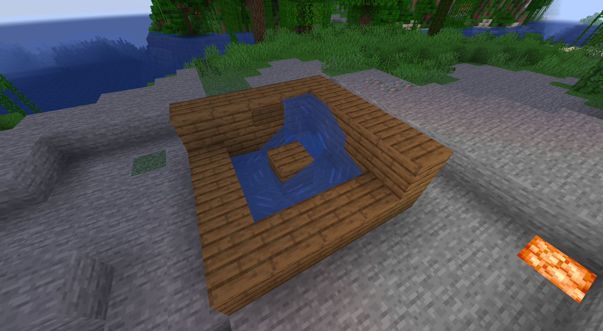

# AFKPRewards
The official documentation for the AFK Pool Rewards Minecraft plugin

_Minecraft AFK Pool Rewards Plugin_
####  

**AFKPRewards** brings a nifty little feature that allows you to setup AFK Pools and then grant Economy money to players that are currently within the set pool area! With a simple integration and easy to use config values, **AFKPRewards** will surely keep your server bumpin'!

> NOTE:  
> You **_MUST_** have **Vault** and an _Economy_ plugin installed on your server for **AFKPRewards** to work!

## Setup
Below there is an image that will display a very simple built **AFK Pool** and this format is necessary for the actual reward system to work. The pool needs to have a center block the AFK players can wade around whilst they are AFK, _AND_ this is where you will stand when setting the location of the AFK Pool. **_BE SURE_ to set a SLAB on the ground where the water is highest in the image!** This allows for the _up-n-down_ movement of the AFK Pool!
####  

####  

When your pool is built, simply stand on the block in the center and use the `/setpool` command. Thats it! Any players that enter the pool tide and go AFK will automatically be rewarded based on the values in the config.

## Configuration
| Key | Value | Description |
| --- | --- | --- |
| timerdelay | 3600 | The amount of SECONDS the AFK players must be in the pool to recieve rewards. **Default is 3600 seconds = 1 hour** |
| pool-radius | 2 | The default radius players must be in to receive the rewards. Defaults to 1 block out from center in radius |
| pool-reward-amount | 500 | The default amount of Economy Money rewarded to the player |
####  

## Commands
| Command | Args | Description |
| --- | --- | --- |
| /setpool | N/A | Sets the location the player is standing on to an AFKPool center |
####  

## Permissions
Only one permission, and it defaults to O.P.
| Permission | Description |
| --- | --- |
| afkpr.setpool | Allows player to set an AFKPool center location |
####  

## Support
**F4ngdev** is always working tirelessly to ensure quality functional plugins, and should any questions or needs arise, we invite you to open a support ticket here on the **CakeSMP Github** where we can manage and get all things plugin related handled. If this forum isn't working for you, we always have the [**F4ngdev Discord**](https://discord.gg/k28sR69n5f) where everything plugin and development related is open-discussion.
